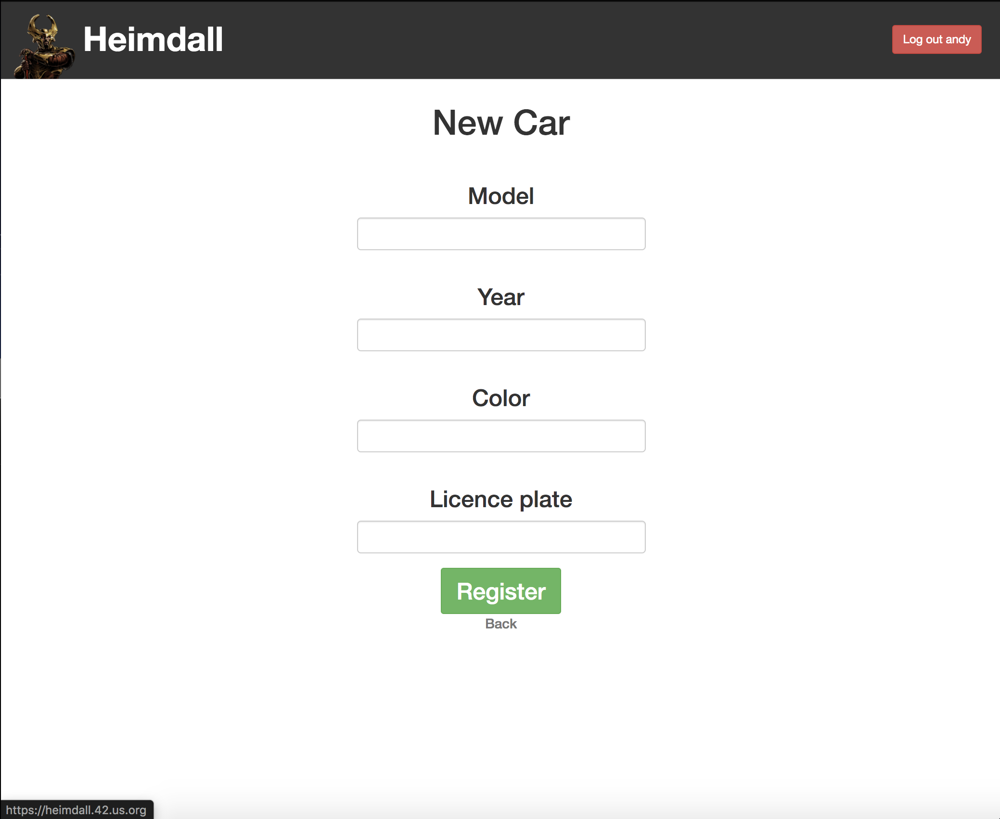

<!--
*** Thanks for checking out the Best-README-Template. If you have a suggestion
*** that would make this better, please fork the repo and create a pull request
*** or simply open an issue with the tag "enhancement".
*** Thanks again! Now go create something AMAZING! :D
***
***
***
*** To avoid retyping too much info. Do a search and replace for the following:
*** github_username, repo_name, twitter_handle, email, project_title, project_description
-->

<!-- PROJECT SHIELDS -->
<!--
*** I'm using markdown "reference style" links for readability.
*** Reference links are enclosed in brackets [ ] instead of parentheses ( ).
*** See the bottom of this document for the declaration of the reference variables
*** for contributors-url, forks-url, etc. This is an optional, concise syntax you may use.
*** https://www.markdownguide.org/basic-syntax/#reference-style-links
-->

<!-- PROJECT LOGO -->
 

  

  <h3 align="center">Car Parking App: Heimdall</h3>

  

    A demo version of Ruby on Rails CRUD app for registering cars.
     
    <a href="https://github.com/MooseandSquvirrel/parking_app.git"><strong>Explore the docs »</strong></a>
     
     
    <a href="https://afternoon-ridge-28353.herokuapp.com/">View Demo</a>
    ·
    <a href="https://en.wikipedia.org/wiki/Heimdallr">Heim who?</a>
  

<!-- TABLE OF CONTENTS -->

  
<h2 style="display: inline-block">Table of Contents</h2>

  <ol>
    <li>
      <a href="#about-the-project">About The Project</a>
      <ul>
        <li><a href="#built-with">Built With</a></li>
      </ul>
    </li>
    <li>
      <a href="#getting-started">Getting Started</a>
      <ul>
        <li><a href="#prerequisites">Prerequisites</a></li>
        <li><a href="#installation">Installation</a></li>
      </ul>
    </li>
    <li><a href="#usage">Usage</a></li>
    <li><a href="#contributors">Contributors</a></li>
    <li><a href="#contact">Contact</a></li>
  </ol>

<!-- ABOUT THE PROJECT -->
## About The Project

This Rails desktop application was created as an internal tool by 42 Paris staff for 42 Silicon Valley staff and students to keep track of vehicles in the parking areas, and which vehicles are authorized to park there. It had an outdated backend with old data and a very sparse frontend design, both of which I was asked to update. I don't consider myself a designer but I very much enjoyed developing some fun css animations to go with the theme of a viking god for which the program was named, Heimdall.

This version has had it's authentication and database information removed and disconnected for demo purposes. It is a simple example of the process a user would experience registering their car(s) in the updated site after login.

### Original GUI:

### Updated GUI:

### Built With

* [HTML5](https://html.com/html5/) / [CSS3](https://developer.mozilla.org/en-US/docs/Web/CSS)
* [Javascript](https://www.javascript.com/)
* [JQuery](https://jquery.com/)
* [Ruby on Rails](https://expressjs.com/) 
* [Postgres](https://www.postgresql.org/)

<!-- GETTING STARTED -->
## Getting Started

The official desktop application was not meant for being open-sourced and therefore
is not for use in it's full functionality to be reproduced locally. This is because of the permissions required including:
staff/employee permissions, API scope and other necessary info not accessible to the public. The application's
database, confidential information and files integral to its functioning have therefore been removed. 

To see the demo, please visit: <a href="https://afternoon-ridge-28353.herokuapp.com/">Heimdall Demo</a>
   
NOTE: If cars are currently created/listed by previous visitors to the site, delete them too see the landing page for when no cars registered for the student for animation.

<!-- USAGE EXAMPLES -->
## Usage

Rails CRUD app for tracking parking lot registration.

_For more examples, try it out: [Demo](https://afternoon-ridge-28353.herokuapp.com/)_

<!-- CONTACT -->
## Contact

Andy Gardner - web.dev.bud1@gmail.com

Project Link: [https://github.com/MooseandSquvirrel/parking_app.git](https://github.com/MooseandSquvirrel/parking_app.git)

## Contributors
42 Paris Staff (Original Authors)
Sasha Oleksandra
Andy Gardner

###Attributes

Icons made by <a href="https://www.flaticon.com/authors/freepik" title="Freepik">Freepik</a> from <a href="https://www.flaticon.com/" title="Flaticon">www.flaticon.com</a>

